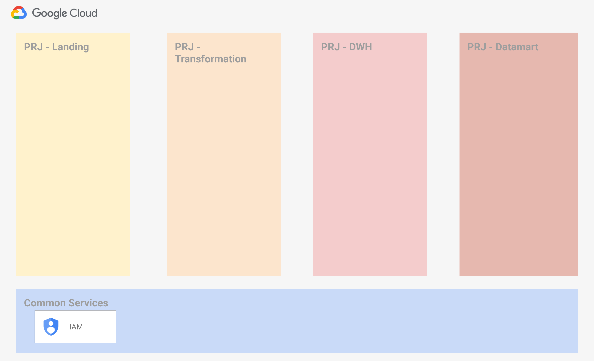

# Data Platform Foundations - Environment (Step 1)

This is the first step needed to deploy Data Platform Foundations, which creates projects and service accounts. Please refer to the [top-level Data Platform README](../README.md) for prerequisites.

The projects that will be created are:

- Common services
- Landing
- Orchestration & Transformation
- DWH
- Datamart

A main service account named `projects-editor-sa` will be created under the common services project, and it will be granted editor permissions on all the projects in scope.

This is a high level diagram of the created resources:



## Running the example

To create the infrastructure:

- specify your variables in a `terraform.tvars`

```tfm
billing_account = "1234-1234-1234"
parent          = "folders/12345678"
```

- make sure you have the right authentication setup (application default credentials, or a service account key)
- **The output of this stage contains the values for the resources stage**
- run `terraform init` and `terraform apply`

Once done testing, you can clean up resources by running `terraform destroy`.

<!-- BEGIN TFDOC -->
## Variables

| name | description | type | required | default |
|---|---|:---: |:---:|:---:|
| billing_account_id | Billing account id. | <code title="">string</code> | ✓ |  |
| root_node | Parent folder or organization in 'folders/folder_id' or 'organizations/org_id' format. | <code title="">string</code> | ✓ |  |
| *prefix* | Prefix used to generate project id and name. | <code title="">string</code> |  | <code title="">null</code> |
| *project_names* | Override this variable if you need non-standard names. | <code title="object&#40;&#123;&#10;datamart       &#61; string&#10;dwh            &#61; string&#10;landing        &#61; string&#10;services       &#61; string&#10;transformation &#61; string&#10;&#125;&#41;">object({...})</code> |  | <code title="&#123;&#10;datamart       &#61; &#34;datamart&#34;&#10;dwh            &#61; &#34;datawh&#34;&#10;landing        &#61; &#34;landing&#34;&#10;services       &#61; &#34;services&#34;&#10;transformation &#61; &#34;transformation&#34;&#10;&#125;">...</code> |
| *service_account_names* | Override this variable if you need non-standard names. | <code title="object&#40;&#123;&#10;main &#61; string&#10;&#125;&#41;">object({...})</code> |  | <code title="&#123;&#10;main &#61; &#34;data-platform-main&#34;&#10;&#125;">...</code> |
| *service_encryption_key_ids* | Cloud KMS encryption key in {LOCATION => [KEY_URL]} format. Keys belong to existing project. | <code title="object&#40;&#123;&#10;multiregional &#61; string&#10;global        &#61; string&#10;&#125;&#41;">object({...})</code> |  | <code title="&#123;&#10;multiregional &#61; null&#10;global        &#61; null&#10;&#125;">...</code> |

## Outputs

| name | description | sensitive |
|---|---|:---:|
| project_ids | Project ids for created projects. |  |
| service_account | Main service account. |  |
| service_encryption_key_ids | Cloud KMS encryption keys in {LOCATION => [KEY_URL]} format. |  |
<!-- END TFDOC -->
