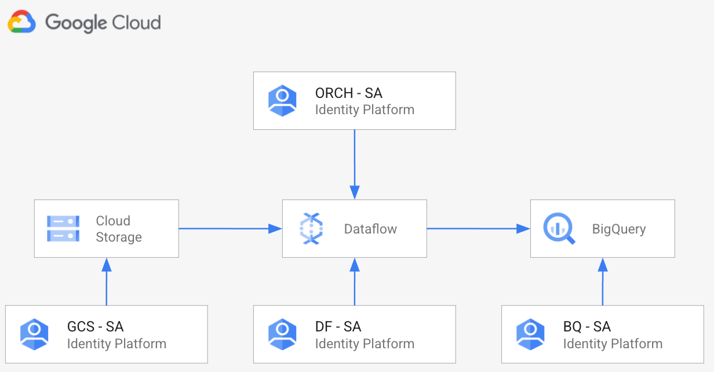

# Cloud Storage to Bigquery with Cloud Dataflow with least privileges

This example creates the infrastructure needed to run a [Cloud Dataflow](https://cloud.google.com/dataflow) pipeline to import data from [GCS](https://cloud.google.com/storage) to [Bigquery](https://cloud.google.com/bigquery). The example will create different service accounts with least privileges on resources. To run the pipeline, users listed in `data_eng_users` or `data_eng_groups` can impersonate all those service accounts.

The solution will use:
 - internal IPs for GCE and Dataflow instances
 - Cloud NAT to let resources egress to the Internet, to run system updates and install packages
 - rely on impersonation to avoid the use of service account keys
 - service accounts with least privilege on each resources
 
The example is designed to match real-world use cases with a minimum amount of resources. It can be used as a starting point for more complex scenarios.

This is the high level diagram:



## Managed resources and services

This sample creates several distinct groups of resources:

- projects
  - Service Project configured for GCS buckets, Dataflow instances and BigQuery tables and orchestration
- networking
  - VPC network
  - One subnet
  - Firewall rules for [SSH access via IAP](https://cloud.google.com/iap/docs/using-tcp-forwarding) and open communication within the VPC
- IAM
  - One service account for uploading data into the GCS landing bucket
  - One service account for Orchestration
  - One service account for Dataflow instances
  - One service account for Bigquery tables
- GCS
  - One bucket
- BQ
  - One dataset

In this example you can also configure users or group of user to assign them viewer role on the resources created and the ability to imprsonate service accounts to test dataflow pipelines before autometing them with Composer or any other orchestration systems.

## Deploy your enviroment

Run Terraform init:

```
$ terraform init
```

Configure the Terraform variable in your `terraform.tfvars` file. You need to spefify at least the following variables:

```
billing_account = "0011322-334455-667788"
root_node       = "folders/123456789012"
project_name    = "test-demo-tf-001"
data_eng_users  = ["your_email@domani.example"]
```

You can run now:

```
$ terraform apply
```

You should see the output of the Terraform script with resources created and some command pre-created for you to run the example following steps below.

## Test your environment with Cloud Dataflow

We assume all those steps are run using a user listed on `data_eng_users` or `data_eng_groups`. You can authenticate as the user using the following command:

```
$ gcloud init
```

For the purpose of the example we will import from GCS to Bigquery a CSV file with the following structure:

```
name,surname,timestam
```

We need to create 3 file:
 - A `person.csv` file containing your data in the form `name,surname,timestam`. Here an example line `Lorenzo,Caggioni,1637771951'.
 - A `person_udf.js` containing the UDF javascript file used by the Dataflow template.
 - A `person_schema.json` file containing the table schema used to import the CSV.
 
You can find an example of those file in the folder `./data-demo`. You can copy the example files in the GCS bucket using the  command returned in the terraform output as `command-01-gcs`.

```bash
gsutil -i gcs-landing@PROJECT.iam.gserviceaccount.com cp data-demo/* gs://LANDING_BUCKET
```

We can now run the Dataflow pipeline using the `gcloud` returned in the terraform output as `command-03-dataflow`.

```bash
gcloud --impersonate-service-account=orch-test@PROJECT.iam.gserviceaccount.com dataflow jobs run test_batch_01 \
    --gcs-location gs://dataflow-templates/latest/GCS_Text_to_BigQuery \
    --project PROJECT \
    --region REGION \
    --disable-public-ips \
    --subnetwork https://www.googleapis.com/compute/v1/projects/PROJECT/regions/REGION/subnetworks/subnet \
    --staging-location gs://PROJECT-eu-df-tmplocation \
    --service-account-email df-test@PROJECT.iam.gserviceaccount.com \
    --parameters \
javascriptTextTransformFunctionName=transform,\
JSONPath=gs://PROJECT-eu-data/person_schema.json,\
javascriptTextTransformGcsPath=gs://PROJECT-eu-data/person_udf.js,\
inputFilePattern=gs://PROJECT-eu-data/person.csv,\
outputTable=PROJECT:bq_dataset.person,\
bigQueryLoadingTemporaryDirectory=gs://PROJECT-eu-df-tmplocation 
```

You can check data imported into Google BigQuery using the  command returned in the terraform output as `command-03-bq`:

```
bq query --use_legacy_sql=false 'SELECT * FROM `PROJECT.datalake.person` LIMIT 1000'
```
