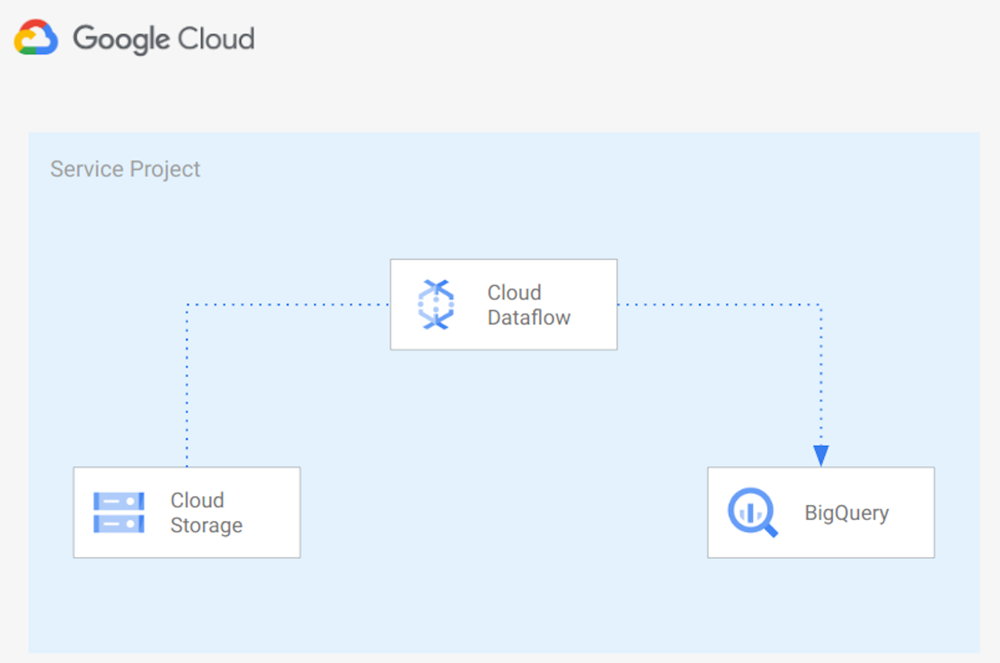

# Ingest CSV files from GCS into Bigquery

In this example we create a Python [Apache Beam](https://beam.apache.org/) pipeline running on [Google Cloud Dataflow](https://cloud.google.com/dataflow/) to import CSV files into BigQuery adding a timestamp to each row. Below the architecture used:



The architecture uses:
* [Google Cloud Storage]() to store CSV source files
* [Google Cloud Dataflow](https://cloud.google.com/dataflow/) to read files from Google Cloud Storage, Transform data base on the structure of the file and import the data into Google BigQuery
* [Google BigQuery](https://cloud.google.com/bigquery/) to store data in a Data Lake.

You can use this script as a starting point to import your files into Google BigQuery. You'll probably need to adapt the script logic to your requirements.

## 1. Prerequisites
 - Up and running GCP project with enabled billing account
 - gcloud installed and initiated to your project
 - Google Cloud Dataflow API enabled
 - Google Cloud Storage Bucket containing the file to import (CSV format) containings name, surnames and age. Example: `Mario,Rossi,30`.
 - Google Cloud Storage Bucket for temp and staging Google Dataflow files
 - Google BigQuery dataset
 - [Python](https://www.python.org/) >= 3.7 and python-dev module
 - gcc
 - Google Cloud [Application Default Credentials](https://cloud.google.com/sdk/gcloud/reference/auth/application-default/login)

## 2. Create virtual environment
Create a new virtual environment (recommended) and install requirements:

```
virtualenv env
source ./env/bin/activate
pip install -r requirements.txt
```

## 4. Upload files into Google Cloud Storage
Upload files to be imported into Google Bigquery in a Google Cloud Storage Bucket. You can use `gsutil` using a command like:
```
gsutil cp [LOCAL_OBJECT_LOCATION] gs://[DESTINATION_BUCKET_NAME]/
```

Files need to be in CSV format,For example:
```
Enrico,Bianchi,20
Mario,Rossi,30
```

You can use the [person_details_generator](../person_details_generator/) script if you want to create random person details.

## 5. Run pipeline
You can check parameters accepted by the `data_ingestion.py` script with the following command:
```
python pipelines/data_ingestion --help
```

You can run the pipeline locally with the following command:
```
python data_ingestion.py \
--runner=DirectRunner \
--project=###PUT HERE PROJECT ID### \
--input=###PUT HERE THE FILE TO IMPORT. EXAMPLE: gs://bucket_name/person.csv ### \
--output=###PUT HERE BQ DATASET.TABLE###
```

or you can run the pipeline on Google Dataflow using the following command:

```
python pipelines/data_ingestion_configurable.py \
--runner=DataflowRunner \
--max_num_workers=100 \
--autoscaling_algorithm=THROUGHPUT_BASED \
--region=###PUT HERE REGION### \
--staging_location=###PUT HERE GCS STAGING LOCATION### \
--temp_location=###PUT HERE GCS TMP LOCATION###\
--project=###PUT HERE PROJECT ID### \
--input-bucket=###PUT HERE GCS BUCKET NAME### \
--input-path=###PUT HERE INPUT FOLDER### \
--input-files=###PUT HERE FILE NAMES### \
--bq-dataset=###PUT HERE BQ DATASET NAME###
```

## 6. Check results
You can check data imported into Google BigQuery from the Google Cloud Console UI.