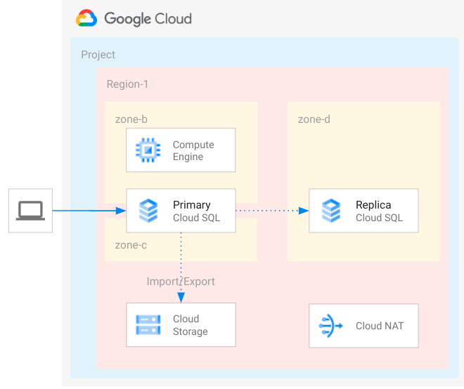

# Cloud SQL instance with multi-region read replicas

This example creates the [Cloud SQL instance](https://cloud.google.com/sql) with multi-reagion read replica solution described in the [`Cloud SQL for PostgreSQL disaster recovery`](https://cloud.google.com/architecture/cloud-sql-postgres-disaster-recovery-complete-failover-fallback) article. 

The solution is resiliant to a regional outage. To get familiar with the procedure needed in the unfortunate case of a disaster recovery, we suggest to follow steps described in the [`Simulating a disaster (region outage)`](https://cloud.google.com/architecture/cloud-sql-postgres-disaster-recovery-complete-failover-fallback#phase-2) article.

The solution will use:
- Postgre SQL instance with Private IP

This is the high level diagram:



## Move to real use case consideration
In the example we implemented some compromise to keep the example minimal and easy to read. On a real word use case, you may evaluate the option to:
 - Configure a Shared-VPC
 - Use VPC-SC to mitigate data exfiltration

## Deploy your enviroment

We assume the identiy running the following steps has the following role:
 - `resourcemanager.projectCreator` in case a new project will be created.
 - `owner` on the project in case you use an existing project. 

Run Terraform init:

```
$ terraform init
```

Configure the Terraform variable in your `terraform.tfvars` file. You need to spefify at least the following variables:

```
data_eng_principals = ["user:data-eng@domain.com"]
project_id      = "datalake-001"
prefix          = "prefix"
```

You can run now:

```
$ terraform apply
```

You should see the output of the Terraform script with resources created and some command pre-created for you to run the example following steps below.
TBC
<!-- BEGIN TFDOC -->

## Variables

| name | description | type | required | default |
|---|---|:---:|:---:|:---:|
| [prefix](variables.tf#L29) | Unique prefix used for resource names. Not used for project if 'project_create' is null. | <code>string</code> | ✓ |  |
| [project_id](variables.tf#L43) | Project id, references existing project if `project_create` is null. | <code>string</code> | ✓ |  |
| [regions](variables.tf#L48) | Map of instance_name => location where instances will be deployed. | <code>map&#40;string&#41;</code> | ✓ |  |
| [cloudsql_psa_range](variables.tf#L17) | Range used for the Private Service Access. | <code>string</code> |  | <code>&#34;10.60.0.0&#47;16&#34;</code> |
| [database_version](variables.tf#L23) | Database type and version to create. | <code>string</code> |  | <code>&#34;POSTGRES_13&#34;</code> |
| [project_create](variables.tf#L34) | Provide values if project creation is needed, uses existing project if null. Parent is in 'folders/nnn' or 'organizations/nnn' format. | <code title="object&#40;&#123;&#10;  billing_account_id &#61; string&#10;  parent             &#61; string&#10;&#125;&#41;">object&#40;&#123;&#8230;&#125;&#41;</code> |  | <code>null</code> |
| [tier](variables.tf#L57) | The machine type to use for the instances. See See https://cloud.google.com/sql/docs/postgres/create-instance#machine-types. | <code>string</code> |  | <code>&#34;db-g1-small&#34;</code> |

## Outputs

| name | description | sensitive |
|---|---|:---:|
| [connection_names](outputs.tf#L17) | Connection name of each instance. |  |
| [ips](outputs.tf#L22) | IP address of each instance. |  |
| [project_id](outputs.tf#L27) | ID of the project containing all the instances. |  |

<!-- END TFDOC -->
