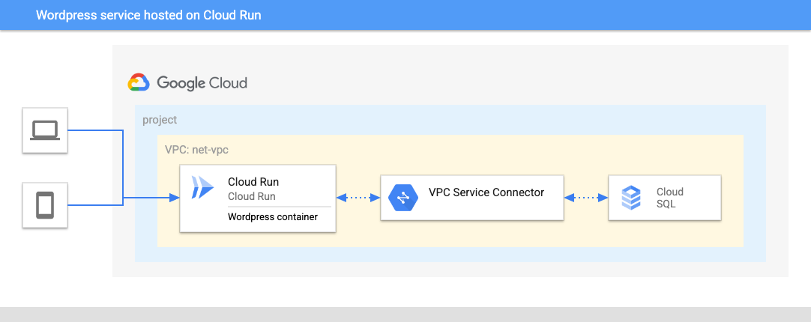

# Wordpress deployment on Cloud Run

43% of the Web is built on Wordpress. Because of its simplicity and versatility, Wordpress can be used for internal websites as well as customer facing e-commerce platforms in small to large businesses, while still offering security.

This repository contains the necessary Terraform files to deploy a functioning new Wordpress website exposed to the public internet with minimal technical overhead.

This architecture can be used for the following use cases and more:

* Blog
* Intranet / internal Wiki
* E-commerce platform

## Architecture



The main components that are deployed in this architecture are the following (you can learn about them by following the hyperlinks):

* [Cloud Run](https://cloud.google.com/run): serverless PaaS offering to host containers for web-oriented applications, while offering security, scalability and easy versioning
* [Cloud SQL](https://cloud.google.com/sql): Managed solution for SQL databases

## Setup

### Prerequisites

#### Setting up the project for the deployment

This example will deploy all its resources into the project defined by the `project_id` variable. Please note that we assume this project already exists. However, if you provide the appropriate values to the `project_create` variable, the project will be created as part of the deployment.

If `project_create` is left to null, the identity performing the deployment needs the `owner` role on the project defined by the `project_id` variable. Otherwise, the identity performing the deployment needs `resourcemanager.projectCreator` on the resource hierarchy node specified by `project_create.parent` and `billing.user` on the billing account specified by `project_create.billing_account_id`.

### Deployment

#### Step 0: Cloning the repository

Click on the image below, sign in if required and when the prompt appears, click on “confirm”.

[<p align="center">  </p>]()

LINK NEEDED --> can only be added after PR

Before we deploy the architecture, you will at least need the following information (for more precise configuration see the Variables section):

* The project ID.
* A Google Cloud Registry path to a Wordpress container image.

#### Step 1: Add Wordpress image

In order to deploy the Wordpress service to Cloud Run, you need to store the [Wordpress image](https://hub.docker.com/r/bitnami/wordpress/) in Google Cloud Registry (GCR).

Make sure that the Google Container Registry API is enabled and run the following commands in your Cloud Shell environment with your `project_id` in place of the `MY_PROJECT` placeholder:

``` {shell}
docker pull bitnami/wordpress
```

```{shell}
docker tag bitnami/wordpress gcr.io/MY_PROJECT/wordpress
```
```{shell

docker push gcr.io/MY_PROJECT/wordpress
```

** Important : please note this example architecture is built for this particular bitnami image, if you decide to use another one this example might not work.**

#### Step 2: Deploy resources

Once you have the required information, head back to the Cloud Shell editor. Make sure you’re in the directory of this tutorial (where this README is in).

Configure the Terraform variables in your terraform.tfvars file. See [terraform.tfvars.sample](terraform.tfvars.sample) as starting point - just copy it to `terraform.tfvars` and edit the latter.

Initialize your Terraform environment and deploy the resources:

``` {shell}
terraform init
terraform apply
```
The resource creation will take a few minutes.

Upon completion, you will see the output with the values for the Cloud Run service and the user and password to access the `/admin` part of the website. You can also view it later with:
``` {shell}
terraform output
# or for the concrete variable:
terraform output cloud_run_service
```


#### Clean up your environment

The easiest way to remove all the deployed resources is to run the following command in Cloud Shell:

``` {shell}
terraform destroy
```

The above command will delete the associated resources so there will be no billable charges made afterwards.
<!-- BEGIN TFDOC -->

## Variables

| name | description | type | required | default |
|---|---|:---:|:---:|:---:|
| [project_id](variables.tf#L32) | Project id, references existing project if `project_create` is null. | <code>string</code> | ✓ |  |
| [wordpress_image](variables.tf#L49) | Image to run with Cloud Run, starts with \"gcr.io\" | <code>string</code> | ✓ |  |
| [cloud_run_invoker](variables.tf#L61) | IAM member authorized to access the end-point (for example, 'user:YOUR_IAM_USER' for only you or 'allUsers' for everyone) | <code>string</code> |  | <code>&#34;allUsers&#34;</code> |
| [connector_cidr](variables.tf#L67) | CIDR block for the VPC serverless connector (10.8.0.0/28 by default) | <code>string</code> |  | <code>&#34;10.8.0.0&#47;28&#34;</code> |
| [prefix](variables.tf#L17) | Unique prefix used for resource names. Not used for project if 'project_create' is null. | <code>string</code> |  | <code>&#34;&#34;</code> |
| [principals](variables.tf#L43) | List of emails of people/service accounts to give rights to, eg 'user@domain.com'. | <code>list&#40;string&#41;</code> |  | <code>&#91;&#93;</code> |
| [project_create](variables.tf#L23) | Provide values if project creation is needed, uses existing project if null. Parent is in 'folders/nnn' or 'organizations/nnn' format. | <code title="object&#40;&#123;&#10;  billing_account_id &#61; string&#10;  parent             &#61; string&#10;&#125;&#41;">object&#40;&#123;&#8230;&#125;&#41;</code> |  | <code>null</code> |
| [psa_cidr](variables.tf#L80) | CIDR block for Private Service Access for CloudSQL (10.60.0.0/24 by default) | <code>string</code> |  | <code>&#34;10.60.0.0&#47;24&#34;</code> |
| [region](variables.tf#L37) | Region for the created resources | <code>string</code> |  | <code>&#34;europe-west4&#34;</code> |
| [sql_vpc_cidr](variables.tf#L73) | CIDR block for the VPC for the CloudSQL (10.0.0.0/20 by default) | <code>string</code> |  | <code>&#34;10.0.0.0&#47;20&#34;</code> |
| [wordpress_port](variables.tf#L54) | Port for the Wordpress image (8080 by default) | <code>number</code> |  | <code>8080</code> |

## Outputs

| name | description | sensitive |
|---|---|:---:|
| [cloud_run_service](outputs.tf#L17) | CloudRun service URL | ✓ |
| [wp_password](outputs.tf#L28) | Wordpress user password | ✓ |
| [wp_user](outputs.tf#L23) | Wordpress username |  |

<!-- END TFDOC -->
