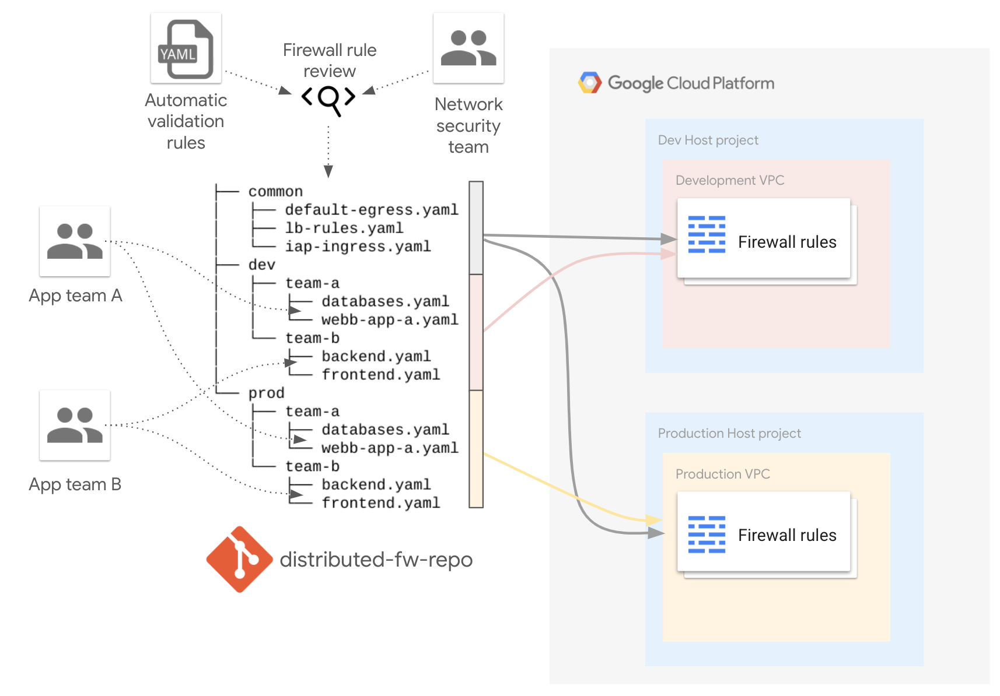

# Decentralized firewall management

This sample shows how a decentralized firewall management can be organized using the [firewall-yaml](../../modules/net-vpc-firewall-yaml) module.

This approach is a good fit when Shared VPCs are used across multiple application/infrastructure teams. A central repository keeps environment/team specific folders with firewall definitions in `yaml` format. This is the high level diagram:

<!-- BEGIN TFDOC -->
## Variables

| name | description | type | required | default |
|---|---|:---: |:---:|:---:|
| billing_account_id | Billing account id used as default for new projects. | <code title="">string</code> | ✓ |  |
| prefix | Prefix used for resources that need unique names. | <code title="">string</code> | ✓ |  |
| root_node | Hierarchy node where projects will be created, 'organizations/org_id' or 'folders/folder_id'. | <code title="">string</code> | ✓ |  |
| *ip_ranges* | Subnet IP CIDR ranges. | <code title="map&#40;string&#41;">map(string)</code> |  | <code title="&#123;&#10;prod &#61; &#34;10.0.16.0&#47;24&#34;&#10;dev  &#61; &#34;10.0.32.0&#47;24&#34;&#10;&#125;">...</code> |
| *project_services* | Service APIs enabled by default in new projects. | <code title="list&#40;string&#41;">list(string)</code> |  | <code title="&#91;&#10;&#34;container.googleapis.com&#34;,&#10;&#34;dns.googleapis.com&#34;,&#10;&#34;stackdriver.googleapis.com&#34;,&#10;&#93;">...</code> |
| *region* | Region used. | <code title="">string</code> |  | <code title="">europe-west1</code> |

## Outputs

| name | description | sensitive |
|---|---|:---:|
| fw_rules | Firewall rules. |  |
| projects | Project ids. |  |
| vpc | Shared VPCs. |  |
<!-- END TFDOC -->
